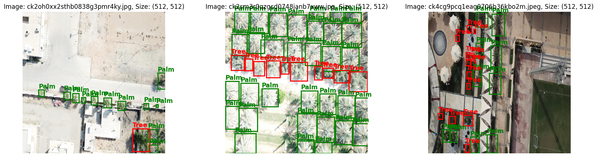

# Palm Tree Detection and Counting



## Project Overview

This project focuses on detecting and counting palm trees in images using computer vision techniques. It leverages a pre-trained model, `fasterrcnn_resnet50_fpn`, and fine-tunes it on a custom dataset with annotations provided in a CSV file format. The project also incorporates MLOps practices, including model versioning, data tracking, and pipeline for quick execution, using tools like Docker and MLflow.

## Table of Contents
1. [Project Overview](#project-overview)
2. [Features](#features)
3. [Data](#data)
4. [Downloading the Dataset](#downloading-the-dataset)
5. [Model Architecture](#model-architecture)
6. [Training](#training)
7. [Metrics](#metrics)
8. [Results](#results)
9. [Installation](#installation)
10. [Usage](#usage)
11. [API](#api)

## Features

- **Object Detection**: Detects and counts palm trees in images using a fine-tuned Faster R-CNN model.
- **Model Performance Metrics**: Calculates Mean Absolute Error (MAE) and Root Mean Squared Error (RMSE) to evaluate counting accuracy.
- **Image Preprocessing**: Automatically resizes images to 320 x 320 and normalizes bounding box coordinates.
- **Visualization**: Displays annotated images with bounding boxes and class labels.
- **API Integration**: Serves a trained model via a FastAPI application.
- **MLOps and DVC Integration**: Uses Docker for containerization and MLflow for experiment tracking and model management.

## Dataset

The [dataset](https://www.kaggle.com/datasets/riotulab/aerial-images-of-palm-trees/data) consists of images of aerial images shot with drones from a palm tree farm, annotated with bounding boxes that identify palm trees and other tree types. The annotations are stored in CSV files, with each row representing a bounding box for a detected object.  The dataset is organized into training and testing sets.

- **Training Images**: `train/`
- **Testing Images**: `test/`
- **Training CSV**: `train_labels.csv`
- **Testing CSV**: `test_labels.csv`

The CSV files have the following columns:

- `filename`: Name of the image file.
- `width`: Width of the image.
- `height`: Height of the image.
- `class`: Class of the object (either `Palm` or `Tree`).
- `xmin`: X-coordinate of the top-left corner of the bounding box.
- `ymin`: Y-coordinate of the top-left corner of the bounding box.
- `xmax`: X-coordinate of the bottom-right corner of the bounding box.
- `ymax`: Y-coordinate of the bottom-right corner of the bounding box.

### Downloading the Dataset

This project includes an automated process to download the dataset from Kaggle.

1. **Prepare Kaggle API Token**:
    - Obtain the Kaggle API token by following the instructions on the [Kaggle API documentation](https://github.com/Kaggle/kaggle-api).
    - Copy the `kaggle.json` file to the appropriate directory:
        - **Windows**: `C:\Users\<YourUsername>\.kaggle\kaggle.json`
        - **Unix/Mac**: `~/.kaggle/kaggle.json`
2. **Configure Dataset Identifier**:
    - Open the `config/config.yaml` file.
    - Set the `dataset_identifier` to the appropriate Kaggle dataset ID. This identifier can be found on the Kaggle dataset page.

## Model Architecture

The model used in this project is `fasterrcnn_resnet50_fpn`, a state-of-the-art object detection model that can detect multiple instances of objects in a single image. The model is fine-tuned on the [aerial-images-of-palm-trees](https://www.kaggle.com/datasets/riotulab/aerial-images-of-palm-trees/data) dataset to adapt to the specific task of palm tree counting.

## Training

The model was trained using the following configuration:

- **Optimizer**: SGD
- **Learning Rate**: 0.01
- **Batch Size**: 16
- **Epochs**: 3
- **Image Size**: 320

The training process was tracked and logged using MLflow. The public MLflow dashboard for the results can be accessed via this [link](https://dagshub.com/franklinosei/palm-trees-counter.mlflow).

## Metrics, Model Evaluation and Performance

### Metrics

The model was evaluated using the [test dataset](https://www.kaggle.com/datasets/riotulab/aerial-images-of-palm-trees/data). The following metrics were used to assess performance:

- **Mean Absolute Error (MAE)**: The average absolute difference between the predicted palm tree counts and the actual counts.
- **Root Mean Squared Error (RMSE)**: The square root of the average squared differences between the predicted and actual palm tree counts.

### Results

The model achieved the following performance on the test dataset:

- **Mean Absolute Error (MAE)**: ***5.47***
- **Root Mean Squared Error (RMSE)**: ***6.98***

These results demonstrate the model's ability to accurately count palm trees in aerial images of palm tree farms. The model's performance can be enhanced by further training and tuning its hyperparameters. Due to resource constraints, the model was trained for only 3 epochs.

## Installation

To run this project locally, follow these steps:

1. **Create a Python environment:**

```bash
python -m venv <env_name>
source <env_name>/bin/activate  # On Windows, use `<env_name>\Scripts\activate`
```

2. **Install the required packages:**

```bash
pip install -r requirements.txt
```

## Usage

### Training the Model and Managing the Pipeline with DVC

To train the model and manage the entire pipeline, follow these steps:

1. **Run the Training Pipeline**:
    
    ```bash
    dvc repro
    ```
    
    This command will execute the pipeline defined in the `dvc.yaml` file, which includes stages for data ingestion, preprocessing, model training, and evaluation.
    
2. **Train the Model Manually**:
If you prefer to train the model directly without running the pipeline with dvc, use the following command:
    
    ```bash
    python train.py
    ```
    
    This script will load the dataset, preprocess the images, fine-tune the `fasterrcnn_resnet50_fpn` model, and log the training metrics and model artifacts to MLflow.
    

### API

The FastAPI-based API is containerized using Docker and configured to run on GPU-enable platforms for ease of deployment. It provides the following endpoints:

- **`/predict`**: Accepts an image and returns the predicted number of palm trees.
- **`/health`**: Checks the server health
- **`/docs`**: API documentation

### Running the API Locally
To run the API without Docker, follow these steps:
 1. Download the model weight via this link: [palm-tree-counter](https://drive.google.com/file/d/1BUQYSwNvkHX5WmVfBN-3L9wgHuLxpe4L/view?usp=drive_link)
 2. Place the downloaded model weight in the `models` directory.
 3. Run the API with the following command:
 ```bash
 uvicorn server:app --port 10000
 ```

### Running the API with Docker

To run the API using Docker, follow these steps:

1. **Build the Docker Image:**
    
    In the root directory of your project, run the following command to build the Docker image:
    
    ```bash
    docker build -t palm-tree-counter-api .
    ```
    
2. **Run the Docker Container:**
    
    After building the image, run the container with the following command:
    
    ```bash
    docker run -d -p 10000:10000 palm-tree-counter-api
    ```
    
    This will start the FastAPI server on `http://localhost:10000`.
    
3. **Access the API:**
    
    You can now access the API endpoints:
    
    - **Prediction Endpoint**: `http://localhost:10000/predict`
    - **Health Endpoint**: `http://localhost:10000/health`
    - **Docs Endpoint**: `http://localhost:10000/docs`
    
    The API will serve the model, allowing you to send images and receive the predicted palm tree counts, bounding boxes and confidence scores.